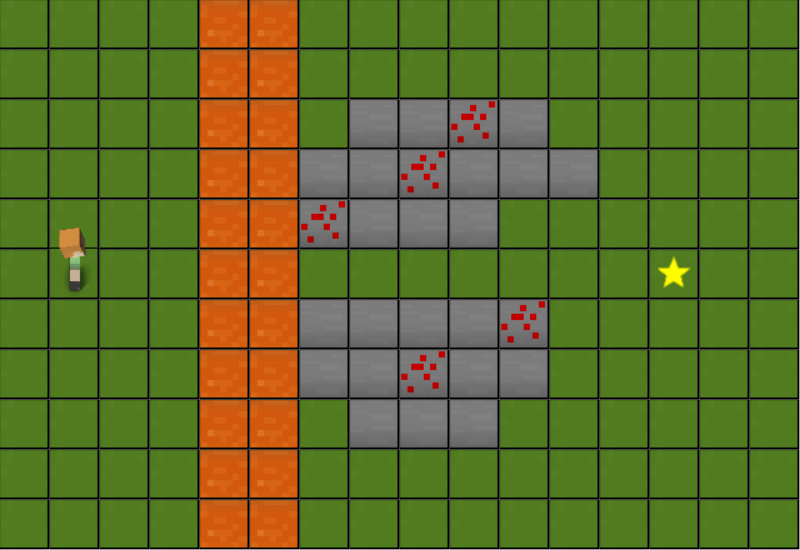

*Due: Wednesday, August 31*

Consider the world shown above.  Your task is to write a program to
accomplish the following:

* Mine at least 4 redstone (the blocks with red dots)
* Build a train track from in front of your character's starting
  location to the star.

You can accomplish the above goals in whatever order you like, the
only thing that matters is that by the end of your program both goals
should be accomplished.  Remember not to fall in the lava!

You may use any of the instructions you remember from the Minecraft
lab.  If you don't remember how the instructions work, you can try
them out on code.org.  Ultimately, you should make sure you write down
any assumptions you make.  As one simple example, when you "place
track", does the track appear in the square your character is on, or
in the square in front of your character?  You can either play with
the command on code.org to figure it out, or just make a reasonable
guess and write down your assumption.

## To Submit

On paper (handwritten or typed):
- A list of all Minecraft instructions used in your program.
  - For each instruction, a description of what it does.
- Your program, achieving both of the above objectives.

## Specifications

- A submission will be **complete** provided your instructions successfully complete both assigned tasks
- A submission will be **partially complete** provided you give good-faith efforts at each task.
