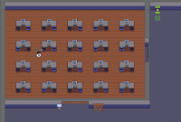

---
# Feel free to add content and custom Front Matter to this file.
# To modify the layout, see https://jekyllrb.com/docs/themes/#overriding-theme-defaults

layout: course-multi
---

## <a name="TAs">TA Office Hours</a>

| Sunday      | Monday      | Tuesday    | Wednesday    | Thursday   |
|-------------|-------------|------------|--------------|------------|
| Riley (7-9) | Chris (6-8) | Ryan (6-8) | Joseph (6-8) | Jada (7-9) |

<!--
For TA hours click here to join the virtual CS lab:

-->

# <a name="description">Overview</a>

{{ site.description }}

## <a name="goals">Learning Goals</a>

Upon completing this course, our goal is for you to be able to:

* Build computer programs to:
  * Effectively solve realistic problems.
  * Organize, analyze, and summarize realistic data sets.
* Read, understand, and explain a computer program.
* Understand and explain computation through:
  * Thinking logically and precisely.
  * Making and testing hypotheses.
* Use modular components to decompose problems and assemble solutions.
* Create abstract, generalized models from specific, complex examples.
* Find pertinent information from programming language documentation.

## <a name="resources">Resources</a>



## <a name="additional-resources">Optional Resources</a>



# <a name="calendar">Calendar</a>
<!--

<a class="btn btn-primary" href="{{ site.submission }}">
  Assignment submission form
</a>

 
-->

| Date     | Topic                                                                                           | 8am                                                                                                     | 11am                                                                                                    | HW and Links                                                                                                            |
|:---------|:------------------------------------------------------------------------------------------------|:--------------------------------------------------------------------------------------------------------|---------------------------------------------------------------------------------------------------------|-------------------------------------------------------------------------------------------------------------------------|
|          |                                                                                                 |                                                                                                         |                                                                                                         |                                                                                                                         |
| W 23 Aug | Intro to CS                                                                                     | [][intro1-p]                                                                          | [][intro2-p]                                                                          | HW: [Survey][survey]                                                                                                    |
| F 25 Aug | Intro to CSCI 150; Algorithms and errors                                                        | [][intro1-p]                                                                          | [][intro2-p]                                                                          | HW: [Minecraft by hand](homework/minecraft.html)                                                                        |
|          |                                                                                                 |                                                                                                         |                                                                                                         |                                                                                                                         |
| M 28 Aug | Intro to Python (math, variables)                                                               | [][py1-v] [][py1-k]                                  | [][py2-v] [][py2-k]                                  | HW: [Sign up for CodeGrade](https://app.codegra.de/courses/5296/enroll/fedf2cf9-bdb3-489d-860b-9f68fd53bd7f)            |
| W 30 Aug | Intro to Python (functions)                                                                     | [][fun1-v] [][fun1-k]                                | [][fun2-v] [][fun2-k]                                |                                                                                                                         |
| F  1 Sep | Booleans                                                                                        | [][bool1-v] [][bool1-k]                              | [][bool2-v] [][bool2-k]                              | HW: [Boolean practice](homework/booleans.html)                                                                          |
|          |                                                                                                 |                                                                                                         |                                                                                                         |                                                                                                                         |
| M  4 Sep | *Labor Day*                                                                                     |                                                                                                         |                                                                                                         |                                                                                                                         |
| W  6 Sep | Conditionals                                                                                    |                                                                                                         |                                                                                                         |                                                                                                                         |
| F  8 Sep | Tracing I                                                                                       | [][tracing-v]                                                                    |                                                                                                         | HW: [CodingBat Conditional and By Hand Tracing Practice](homework/codingbat-conditional.html)                           |
|          |                                                                                                 |                                                                                                         |                                                                                                         |                                                                                                                         |
| M 11 Sep | PyCharm and I/O                                                                                 | [][pyc1-v] [][pyc1-py]                                        | [][pyc2-v] [][pyc2-py]                                        | [Practice Exam 1](/exams/cs150-exam1-practice-fall2023.pdf)                                                             |
| W 13 Sep | Generative AI                                                                                   | [][ai1-v]                                                                        | [][ai2-v]                                                                        |                                                                                                                         |
| F 15 Sep | Exam 1 Review                                                                                   | [][exam11-v] [][exam11-k]                            | [][exam12-v] [][exam12-k]                            |                                                                                                                         |
|          |                                                                                                 |                                                                                                         |                                                                                                         |                                                                                                                         |
| M 18 Sep | **Exam 1**                                                                                      |                                                                                                         |                                                                                                         |                                                                                                                         |
| W 20 Sep | The `while` loop                                                                                | [][while1-v] [][while1-py] [][collatz1-py] | [][while2-v] [][while2-py] [][collatz2-py] | Project 1 Assigned: [Civic Assistance Q/A System](projects/project1.html)                                               |
| F 22 Sep | Functions and stack tracing                                                                     | [][stk1-v] [][stk1-py] [][stk1-p]           | [][stk2-v] [][stk2-py] [][stk2-p]           |                                                                                                                         |
|          |                                                                                                 |                                                                                                         |                                                                                                         |                                                                                                                         |
| M 25 Sep | Functions and stack tracing                                                                     | [][stk21-v]                                                                      | [][stk22-v]                                                                      | HW: [Function Stack Tracing](homework/function-reading.html)                                                            |
|          | [][stk2a-py] [][stk2b-py] [][stk2c-py] |                                                                                                         |                                                                                                         |                                                                                                                         |
| W 27 Sep | Strings                                                                                         | [][str1-v] [][str1-k]                                | [][str2-v] [][str2-k]                                |                                                                                                                         |
| F 29 Sep | Strings and Loops                                                                               | [][strl1-v] [][strl1-k]                              | [][strl2-v] [][strl2-k]                              | HW: [CodingBat String and Loop practice](homework/codingbat-string-loop.html)                                           |
|          |                                                                                                 |                                                                                                         |                                                                                                         |                                                                                                                         |
| M  2 Oct | Lists                                                                                           | [][list1-v] [][list1-k]                              | [][list2-v] [][list2-k]                              | Project 1 Due                                                                                                           |
| W  4 Oct | List processing examples                                                                        | [][list21-v] [][list1-k]                             | [][list22-v] [][list2-k]                             |                                                                                                                         |
| F  6 Oct | Function Abstraction                                                                            |                                                                                                         |                                                                                                         | [CodingBat List and Loop practice](homework/codingbat-list-loop.html)                                                   |
|          |                                                                                                 |                                                                                                         |                                                                                                         |                                                                                                                         |
| M  9 Oct | The `for` loop                                                                                  |                                                                                                         |                                                                                                         | Project 2 Assigned: Word Games <!-- [Word Games](projects/project2.html) -->                                            |
| W 11 Oct | More `for` loop practice                                                                        |                                                                                                         |                                                                                                         |                                                                                                                         |
| F 13 Oct | *Fall Break*                                                                                    |                                                                                                         |                                                                                                         |                                                                                                                         |
|          |                                                                                                 |                                                                                                         |                                                                                                         |                                                                                                                         |
| M 16 Oct | File I/O                                                                                        |                                                                                                         |                                                                                                         |                                                                                                                         |
| W 18 Oct | The Heap and Mutability                                                                         |                                                                                                         |                                                                                                         |                                                                                                                         |
| F 20 Oct | Exam 2 Review                                                                                   |                                                                                                         |                                                                                                         |                                                                                                                         |
|          |                                                                                                 |                                                                                                         |                                                                                                         |                                                                                                                         |
| M 23 Oct | **Exam 2**                                                                                      |                                                                                                         |                                                                                                         |                                                                                                                         |
| W 25 Oct | Dictionaries I                                                                                  |                                                                                                         |                                                                                                         |                                                                                                                         |
| F 27 Oct | Dictionaries II                                                                                 |                                                                                                         |                                                                                                         | HW: CodingBat more loop practice <!-- [CodingBat more loop practice](homework/codingbat-for-loop.html) -->              |
|          |                                                                                                 |                                                                                                         |                                                                                                         |                                                                                                                         |
| M 30 Oct | Intro to Classes                                                                                |                                                                                                         |                                                                                                         |                                                                                                                         |
| W  1 Nov | Classes/objects example 1                                                                       |                                                                                                         |                                                                                                         |                                                                                                                         |
| F  3 Nov | Classes/objects example 2                                                                       |                                                                                                         |                                                                                                         | HW: Heap Tracing Homework <!-- [Heap Tracing Homework](homework/heap-tracing-homework.pdf) -->                          |
|          |                                                                                                 |                                                                                                         |                                                                                                         |                                                                                                                         |
| M  6 Nov | Intro to PyGame                                                                                 |                                                                                                         |                                                                                                         | Project 2 Due                                                                                                           |
| W  8 Nov | PyGame                                                                                          |                                                                                                         |                                                                                                         |                                                                                                                         |
| F 10 Nov | Classes and PyGame                                                                              |                                                                                                         |                                                                                                         | HW: Class & Dictionary practice <!-- [Class & Dictionary practice]({{site.baseurl}}/homework/dict-class-design.pdf) --> |
|          |                                                                                                 |                                                                                                         |                                                                                                         |                                                                                                                         |
| M 13 Nov | Final Project Discussion                                                                        |                                                                                                         |                                                                                                         | Project 3 Assigned: Final Project <!-- [Final Project]({{site.baseurl}}/projects/final.html) -->                        |
| W 15 Nov | Heap Tracing Practice                                                                           |                                                                                                         |                                                                                                         |                                                                                                                         |
| F 17 Nov | Exam 3 Review                                                                                   |                                                                                                         |                                                                                                         | Project 3 Proposal Due                                                                                                  |
|          |                                                                                                 |                                                                                                         |                                                                                                         |                                                                                                                         |
| M 20 Nov | **Exam 3**                                                                                      |                                                                                                         |                                                                                                         |                                                                                                                         |
| T 21 Nov | **Exam 3 Take Home Due**                                                                        |                                                                                                         |                                                                                                         |                                                                                                                         |
| W 22 Nov | *Thanksgiving Break*                                                                            |                                                                                                         |                                                                                                         |                                                                                                                         |
| F 24 Nov | *Thanksgiving Break*                                                                            |                                                                                                         |                                                                                                         |                                                                                                                         |
|          |                                                                                                 |                                                                                                         |                                                                                                         |                                                                                                                         |
| M 27 Nov | Recursion                                                                                       |                                                                                                         |                                                                                                         |                                                                                                                         |
| W 29 Nov | Recursion (trees)                                                                               |                                                                                                         |                                                                                                         |                                                                                                                         |
| F  1 Dec | Project Workshop in Class                                                                       |                                                                                                         |                                                                                                         |                                                                                                                         |
|          |                                                                                                 |                                                                                                         |                                                                                                         |                                                                                                                         |
| F 8 Dec  | Final Project Presentations                                                                     |                                                                                                         |                                                                                                         |                                                                                                                         |
|          | 11am section: 8:30am-11:30am                                                                    |                                                                                                         |                                                                                                         |                                                                                                                         |
|          | 8am section: 2:00pm-5:00pm                                                                      |                                                                                                         |                                                                                                         |                                                                                                                         |
|          |                                                                                                 |                                                                                                         |                                                                                                         |                                                                                                                         |

[survey]: https://docs.google.com/forms/d/e/1FAIpQLSdn8ol52p2CB3DSkFp3Q04VBxaT8IA0IqjiMJKa_jRxFYFQpg/viewform
[intro1-p]: lectures/F23/2023-08-23-01-intro.pdf
[intro2-p]: lectures/F23/2023-08-23-02-intro.pdf
[py1-v]: https://hendrix.sharepoint.com/sites/Section_29461/_layouts/15/stream.aspx?id=%2Fsites%2FSection%5F29461%2FShared%20Documents%2FGeneral%2FRecordings%2F8%5F28%5F%20Python%20I%2D20230828%5F081037%2DMeeting%20Recording%2Emp4
[py1-k]: https://www.kaggle.com/byorgey/2023-08-28-introduction-to-python-01
[py2-v]: https://hendrix.sharepoint.com/sites/Section_29462/_layouts/15/stream.aspx?id=%2Fsites%2FSection%5F29462%2FShared%20Documents%2FGeneral%2FRecordings%2F8%5F28%5F%20Intro%20to%20Python%2D20230828%5F113247%2DMeeting%20Recording%2Emp4
[py2-k]: https://www.kaggle.com/byorgey/2023-08-28-python-intro-02
[fun1-v]: https://hendrix.sharepoint.com/sites/Section_29461/_layouts/15/stream.aspx?id=%2Fsites%2FSection%5F29461%2FShared%20Documents%2FGeneral%2FRecordings%2F8%5F30%5F%20Introduction%20to%20Python%20functions%2D20230830%5F081033%2DMeeting%20Recording%2Emp4
[fun1-k]: https://www.kaggle.com/byorgey/2023-08-30-python-functions-01
[fun2-v]: https://hendrix.sharepoint.com/sites/Section_29462/_layouts/15/stream.aspx?id=%2Fsites%2FSection%5F29462%2FShared%20Documents%2FGeneral%2FRecordings%2F8%5F30%5F%20Python%20Introduction%20%28functions%29%2D20230830%5F111015%2DMeeting%20Recording%2Emp4
[fun2-k]: https://www.kaggle.com/byorgey/2023-08-30-python-functions-02
[bool1-k]: https://www.kaggle.com/byorgey/2023-09-01-booleans-01
[bool1-v]: https://hendrix.sharepoint.com/sites/Section_29461/_layouts/15/stream.aspx?id=%2Fsites%2FSection%5F29461%2FShared%20Documents%2FGeneral%2FRecordings%2F9%5F1%5F%20Booleans%2D20230901%5F081054%2DMeeting%20Recording%2Emp4
[bool2-k]: https://www.kaggle.com/byorgey/2023-09-01-booleans-02
[bool2-v]: https://hendrix.sharepoint.com/sites/Section_29462/_layouts/15/stream.aspx?id=%2Fsites%2FSection%5F29462%2FShared%20Documents%2FGeneral%2FRecordings%2F9%5F1%5F%20Booleans%2D20230901%5F111026%2DMeeting%20Recording%2Emp4
[pyc1-py]: lectures/F23/demo_file.py
[pyc1-v]: https://hendrix.sharepoint.com/sites/Section_29461/_layouts/15/stream.aspx?id=%2Fsites%2FSection%5F29461%2FShared%20Documents%2FGeneral%2FRecordings%2F9%5F11%5F%20PyCharm%20%2B%20I%5FO%2D20230911%5F081217%2DMeeting%20Recording%2Emp4
[pyc2-py]: lectures/F23/python_demo.py
[pyc2-v]: https://hendrix.sharepoint.com/sites/Section_29462/_layouts/15/stream.aspx?id=%2Fsites%2FSection%5F29462%2FShared%20Documents%2FGeneral%2FRecordings%2F9%5F11%5F%20PyCharm%20%2B%20I%5FO%2D20230911%5F111055%2DMeeting%20Recording%2Emp4
[ai1-v]: https://hendrix.sharepoint.com/sites/Section_29461/_layouts/15/stream.aspx?id=%2Fsites%2FSection%5F29461%2FShared%20Documents%2FGeneral%2FRecordings%2FGenerative%20AI%2D20230913%5F081038%2DMeeting%20Recording%2Emp4
[ai2-v]: https://hendrix.sharepoint.com/sites/Section_29462/_layouts/15/stream.aspx?id=%2Fsites%2FSection%5F29462%2FShared%20Documents%2FGeneral%2FRecordings%2F9%5F13%5F%20Generative%20AI%2D20230913%5F111100%2DMeeting%20Recording%2Emp4
[tracing-v]: https://hendrix.sharepoint.com/:v:/s/Section_28123/EasCDBqu6n1NoVh5RhbYoRwBLLL93QGMDh3H7_6Izr5yGA?e=7CXkNv
[exam11-v]: https://hendrix.sharepoint.com/sites/Section_29461/_layouts/15/stream.aspx?id=%2Fsites%2FSection%5F29461%2FShared%20Documents%2FGeneral%2FRecordings%2F9%5F15%5F%20Exam%201%20review%2D20230915%5F082206%2DMeeting%20Recording%2Emp4
[exam11-k]: https://www.kaggle.com/byorgey/exam-1-practice-01
[exam12-v]: https://hendrix.sharepoint.com/sites/Section_29462/_layouts/15/stream.aspx?id=%2Fsites%2FSection%5F29462%2FShared%20Documents%2FGeneral%2FRecordings%2F9%5F15%5F%20Exam%201%20review%2D20230915%5F112042%2DMeeting%20Recording%2Emp4
[exam12-k]: https://www.kaggle.com/byorgey/exam-1-practice-02
[while1-v]: https://hendrix.sharepoint.com/sites/Section_29461/_layouts/15/stream.aspx?id=%2Fsites%2FSection%5F29461%2FShared%20Documents%2FGeneral%2FRecordings%2F9%5F20%5F%20while%20loops%2D20230920%5F081101%2DMeeting%20Recording%2Emp4
[while1-py]: lectures/F23/8am/while_demo.py
[collatz1-py]: lectures/F23/8am/collatz_demo.py
[while2-v]: https://hendrix.sharepoint.com/sites/Section_29462/_layouts/15/stream.aspx?id=%2Fsites%2FSection%5F29462%2FShared%20Documents%2FGeneral%2FRecordings%2F9%5F20%5F%20while%20loops%2D20230920%5F111056%2DMeeting%20Recording%2Emp4
[while2-py]: lectures/F23/11am/while_demo.py
[collatz2-py]: lectures/F23/11am/collatz_demo.py
[stk1-v]: https://hendrix.sharepoint.com/sites/Section_29461/_layouts/15/stream.aspx?id=%2Fsites%2FSection%5F29461%2FShared%20Documents%2FGeneral%2FRecordings%2F9%5F22%5F%20functions%20and%20stack%20tracing%2D20230922%5F081124%2DMeeting%20Recording%2Emp4
[stk1-py]: lectures/F23/8am/functions.py
[stk1-p]: lectures/F23/8am/2023-09-22-stack-tracing.pdf
[stk2-v]: https://hendrix.sharepoint.com/sites/Section_29462/_layouts/15/stream.aspx?id=%2Fsites%2FSection%5F29462%2FShared%20Documents%2FGeneral%2FRecordings%2F9%5F22%5F%20functions%20%2B%20stack%20tracing%2D20230922%5F111036%2DMeeting%20Recording%2Emp4
[stk2-py]: lectures/F23/11am/functions.py
[stk2-p]: lectures/F23/11am/2023-09-22-stack-tracing.pdf
[stk21-v]: https://hendrix.sharepoint.com/sites/Section_29461/_layouts/15/stream.aspx?id=%2Fsites%2FSection%5F29461%2FShared%20Documents%2FGeneral%2FRecordings%2F9%5F25%5F%20more%20function%20tracing%2D20230925%5F081833%2DMeeting%20Recording%2Emp4
[stk21-p]: lectures/F23/8am/2023-09-25-stack-tracing-2.pdf
[stk22-v]: https://hendrix.sharepoint.com/sites/Section_29462/_layouts/15/stream.aspx?id=%2Fsites%2FSection%5F29462%2FShared%20Documents%2FGeneral%2FRecordings%2F9%5F25%5F%20more%20function%20tracing%2D20230925%5F111540%2DMeeting%20Recording%2Emp4
[stk22-p]: lectures/F23/11am/2023-09-25-stack-tracing2.pdf
[stk2a-py]: lectures/F23/function_tracing.py
[stk2b-py]: lectures/F23/function_tracing_params.py
[stk2c-py]: lectures/F23/function_tracing_params2.py
[str1-v]: https://hendrix.sharepoint.com/sites/Section_29461/_layouts/15/stream.aspx?id=%2Fsites%2FSection%5F29461%2FShared%20Documents%2FGeneral%2FRecordings%2F9%5F27%5F%20strings%2D20230927%5F081144%2DMeeting%20Recording%2Emp4
[str1-k]: https://www.kaggle.com/byorgey/strings-1
[str2-v]: https://hendrix.sharepoint.com/sites/Section_29462/_layouts/15/stream.aspx?id=%2Fsites%2FSection%5F29462%2FShared%20Documents%2FGeneral%2FRecordings%2F9%5F27%5F%20Strings%2D20230927%5F111052%2DMeeting%20Recording%2Emp4
[str2-k]: https://www.kaggle.com/byorgey/strings-2
[strl1-k]: https://www.kaggle.com/code/byorgey/string-and-loop-practice-1
[strl1-v]: https://hendrix.sharepoint.com/sites/Section_29461/_layouts/15/stream.aspx?id=%2Fsites%2FSection%5F29461%2FShared%20Documents%2FGeneral%2FRecordings%2F9%5F29%5F%20String%20%2B%20loop%20practice%2D20230929%5F081025%2DMeeting%20Recording%2Emp4
[strl2-k]: https://www.kaggle.com/code/byorgey/string-and-loop-practice-2
[strl2-v]: https://hendrix.sharepoint.com/sites/Section_29462/_layouts/15/stream.aspx?id=%2Fsites%2FSection%5F29462%2FShared%20Documents%2FGeneral%2FRecordings%2F9%5F29%5F%20String%20%2B%20loop%20practice%2D20230929%5F111034%2DMeeting%20Recording%2Emp4
[list1-k]: https://www.kaggle.com/code/byorgey/lists-1
[list1-v]: https://hendrix.sharepoint.com/sites/Section_29461/_layouts/15/stream.aspx?id=%2Fsites%2FSection%5F29461%2FShared%20Documents%2FGeneral%2FRecordings%2F10%5F2%5F%20lists%2D20231002%5F081105%2DMeeting%20Recording%2Emp4
[list2-k]: https://www.kaggle.com/code/byorgey/lists-2
[list2-v]: https://hendrix.sharepoint.com/sites/Section_29462/_layouts/15/stream.aspx?id=%2Fsites%2FSection%5F29462%2FShared%20Documents%2FGeneral%2FRecordings%2F10%5F2%5F%20lists%2D20231002%5F111045%2DMeeting%20Recording%2Emp4
[list21-v]: https://hendrix.sharepoint.com/sites/Section_29461/_layouts/15/stream.aspx?id=%2Fsites%2FSection%5F29461%2FShared%20Documents%2FGeneral%2FRecordings%2F10%5F4%5F%20more%20lists%2D20231004%5F081013%2DMeeting%20Recording%2Emp4
[list22-v]: https://hendrix.sharepoint.com/sites/Section_29462/_layouts/15/stream.aspx?id=%2Fsites%2FSection%5F29462%2FShared%20Documents%2FGeneral%2FRecordings%2F10%5F4%5F%20more%20lists%2D20231004%5F111054%2DMeeting%20Recording%2Emp4

# Coursework

## <a name="latedays">Late Policy</a>

[*Adapted from Spencer Bagley and David Clark, via [Robert
Talbert](https://rtalbert.org/a-real-world-approach-to-deadlines/)*]

CSCI 150 uses a **real-world policy** on due dates---but this may not
mean what you think!  In the *real* real world, due dates exist but
they are often not ironclad.  The purpose of deadlines is usually to
help motivate you to complete the task, but if you need more time to
get the job done well, you email whoever set the deadline to ask if
you can have more time.  Studies have shown that deadline extension
requests---in moderation and when truly needed---often lead to
*better* employee evaluations (not to mention better work). [*See [Go
Ahead and Ask for More Time on that
Deadline](https://hbr.org/2021/12/go-ahead-and-ask-for-more-time-on-that-deadline)
by Ashley Williams*.]

**If you need an extension on a due date, email me and explain what
you need**, and it will probably be fine.  It helps if you propose a
concrete new deadline (*e.g.* "I can get it done by 5pm on
Wednesday").  If you ask for lots of extensions, we'll work together
to find a way to help you keep up.  Note, however, that late
submissions may not receive feedback as quickly as on-time
submissions.

If you have significant extenuating circumstances that cause you to
miss multiple deadlines, please [come to office
hours](https://byorgey.youcanbook.me) to discuss broader accommodations.  I'm
happy to be flexible, but it helps to know what you need so I can
figure out the best way to help.

## <a name="participation">Course Participation</a>

Each student should schedule and attend at least two office hour
meetings with either their lecture or lab instructor at some point
during the semester.

## <a name="hwqz">Homework</a>

<!--

<a class="btn btn-primary" href="{{ site.submission }}">
  Assignment submission form
</a>

 
-->

| #   | Name                                                                                                                  | Assigned | Due      | Sample Solutions                                                                                                                                      |
|:---:|-----------------------------------------------------------------------------------------------------------------------|----------|:---------|-------------------------------------------------------------------------------------------------------------------------------------------------------|
| 0   | [Survey][survey]                                                                                                      | W Aug 23 | M Aug 28 |                                                                                                                                                       |
| 1   | [Minecraft by hand]({{site.baseurl}}/homework/minecraft.html)                                                         | F Aug 26 | W Aug 30 |                                                                                                                                                       |
| 1.5 | [Sign up for CodeGrade](https://app.codegra.de/courses/5296/enroll/fedf2cf9-bdb3-489d-860b-9f68fd53bd7f)              | M Aug 28 | W Aug 30 |                                                                                                                                                       |
| 2   | [Boolean practice]({{site.baseurl}}/homework/booleans.html)                                                           | F Sep 1  | W Sep 6  |                                                                                                                                                       |
| 3   | [CodingBat Conditional and By Hand Tracing Practice](homework/codingbat-conditional.html)                             | F Sep 8  | W Sep 13 | <!-- [Tracing Solutions](/homework/tracing-sample-solutions/HW-3-Tracing-Solutions.pdf) -->                                                           |
| 4   | [Function Stack Tracing](homework/function-reading.html)                                                              | F Sep 22 | W Sep 27 | <!-- [Tracing Solutions](/homework/tracing-sample-solutions/HW-4-Function-Stack-Tracing-Solutions.pdf) -->                                            |
| 5   | [CodingBat String and Loop practice](homework/codingbat-string-loop.html)                                             | F Sep 29 | W Oct 4  |                                                                                                                                                       |
| 6   | [CodingBat List and Loop practice](homework/codingbat-list-loop.html)                                                 | F Oct 6  | W Oct 11 |                                                                                                                                                       |
| 7   | CodingBat more loop practice <!-- [CodingBat more loop practice](homework/codingbat-for-loop.html) -->                | F Oct 27 | W Nov 1  |                                                                                                                                                       |
| 8   | Heap Tracing Homework <!-- [Heap Tracing Homework](homework/heap-tracing-homework) -->                                | F Nov 3  | W Nov 8  | <!-- [Tracing Solutions](/homework/tracing-sample-solutions/HW-8-Heap-Heap-Tracing-Solutions.pdf) -->                                                 |
| 9   | Dictionary and Class Homework <!-- [Dictionary and Class Homework]({{site.baseurl}}/homework/dict-class-homework) --> | F Nov 10 | W Nov 15 | <!-- [Sample Solution](https://hendrix-my.sharepoint.com/:u:/g/personal/seme_hendrix_edu/EdQKSKuWJ0ROpBpp9DFkY3wBenDzB7uWRcglObOq43whcw?e=WIOeN2) --> |

<!-- |   | [HW 4 Redo](/homework/HW4-Redo-Problems.pdf)                                              |          |          | <\!-- [Tracing Solutions](https://hendrix-my.sharepoint.com/:b:/g/personal/seme_hendrix_edu/EUz_HXO6PH1AtK7UOh4P9hMBax6AG-jKpSwj-VwR7SScfw?e=zneGLv) -\-> | -->

There will often be short homework assignments to be completed,
typically assigned on Friday and due Wednesday.  Homework with coding
practice problems will be submitted electronically. By-hand homework
should be submitted on physical paper at the start of class time --
you can write (neatly) or type and print such solutions.

## <a name="labs">Labs</a>

<a class="btn btn-primary" href="https://app.codegra.de/">
  Lab submission (CodeGrade)
</a>

 

<a href="docs/code-of-conduct/23F/code-of-conduct-23F-W.pdf">Wednesday Lab Code of Conduct</a>

| #  | Name                                                                                      | Completion time | Assigned  | Due       |
|:--:|-------------------------------------------------------------------------------------------|-----------------|-----------|:----------|
| 0  | [Minecraft]({{site.baseurl}}/labs/minecraft.html)                                         | 1-2 hrs         | 23-24 Aug | 30-31 Aug |
| 1  | [Kepler, Newton, Einstein](https://www.kaggle.com/gabrielferrer/kepler-newton-einstein)   | 2-3 hrs         | 30-31 Aug | 6-7 Sep   |
| 2  | [Diagnosing Heart Disease](https://www.kaggle.com/gabrielferrer/diagnosing-heart-disease) | 2.5-3.5 hrs     | 6-7 Sep   | 13-14 Sep |
| 3  | [This Day in History](https://www.kaggle.com/gabrielferrer/this-day-in-history)           | 2-3 hrs         | 13-14 Sep | 20-21 Sep |
| 4  | [Guess My Number]({{site.baseurl}}/labs/guess.html)                                       | 3-4 hrs         | 20-21 Sep | 27-28 Sep |
| 5  | [Mutation is the Word]({{site.baseurl}}/labs/doublets.html)                               | 4-5 hrs         | 27-28 Sep | 4-5 Oct   |
| 6  | [Todo Manager]({{site.baseurl}}/labs/todo-manager.html)                                   | 3.5-4.5 hrs     | 4-5 Oct   | 18-19 Oct |
|    | **No lab** (fall break)                                                                   |                 | 11-12 Oct |           |
| 7  | Caesar's Secrets<!--(https://www.kaggle.com/gabrielferrer/caesar-s-secrets)-->            | 3.5-4.5 hrs     | 18-19 Oct | 25-26 Oct |
| 8  | Sentiment Analysis<!--(https://www.kaggle.com/gabrielferrer/sentiment-analysis) -->       | 3.5-4.5 hrs     | 25-26 Oct | 1-2 Nov   |
| 9  | Water Jugs<!--({{site.baseurl}}/labs/waterjug.html)-->                                    | 3.5-4.5 hrs     | 1-2 Nov   | 8-9 Nov   |
| 10 | Faces<!--({{site.baseurl}}/labs/pygame.html)   -->                                        | 2.5-3.5 hrs     | 8-9 Nov   | 15-16 Nov |
| 11 | Tornado Sirens<!--(https://www.kaggle.com/gabrielferrer/tornado-sirens)-->                | 3.5-4.5 hrs     | 15-16 Nov | 29-30 Nov |
| 12 | (Optional) Project 3 Workshop                                                             |                 | 29-30 Nov |           |

Much of your experience with programming in this course will be through weekly labs. Each lab will be assigned in lab with time allotted to work through the materials, and will be due **by the start of the following lab**.

On these labs, you will work with a partner on the lab assignments. Their name must be listed on any code you hand in as joint work. A partnership should only turn in a **single copy** of the assignment.

<!-- On these labs, you will work with a partner on the lab assignments. Their name must be listed on any code you hand in as joint work. Each partner should **submit their own solution** to the assignment. -->

**Lab attendance is required**. Labs take place in the **Snoddy Computer Lab**, in the Bailey Library. As you go through the exterior door of the library, turn immediately to your left and enter the Snoddy Academic Resource Center. Continue through the door at the far end of the hall into the first computer lab, and then enter the second lab at the back.

## <a name="projects">Projects</a>
<!--

<a class="btn btn-primary" href="{{ site.submission }}">
  Assignment submission form
</a>

 
-->

| # | Name                                                                         | Average time | Assigned | Due   |
|:-:|------------------------------------------------------------------------------|--------------|:--------:|:-----:|
| 1 | [Civic Assistance Q/A System]({{site.baseurl}}/projects/project1.html)       | 3:30         | 20 Sep   | 2 Oct |
| 2 | Word Games <!-- [Word Games]({{site.baseurl}}/projects/project2.html) -->    | 5:50         | 9 Oct    | 6 Nov |
| 3 | Final Project <!-- [Final Project]({{site.baseurl}}/projects/final.html) --> | 12:45        | 13 Nov   | 8 Dec |

You will have three projects in this course. These projects will cover concepts we have discussed in class and in labs, and will be due approximately two to three weeks after they are assigned.

**You must work individually on the projects.** You may discuss concepts and ideas with your classmates, but the code you turn in must be your own. You will be graded not only on correctness, but also technique, documentation and evaluation of your solution. Further details on the grading standards and handin instructions for each project will be given when they are assigned.

## <a name="exams">Exams</a>

There will be three exams. Each exam will have two parts:
* In-class written part: Analysis and tracing of Python code samples.
* Take-home part: At the end of the written exam will appear some Python coding problems, the solutions to which are to be
submitted by the start of the next class period.

* Exam 1: Monday, September 18, covering functions, math, numerical
  data, and conditionals
  - [Practice Exam 1](/exams/cs150-exam1-practice-fall2023.pdf)
  <!-- - [Exam 1 Redo Problems](https://hendrix-my.sharepoint.com/:b:/g/personal/seme_hendrix_edu/EeIcwhaL8x9AjC4wuBhUbRYBewIy5fUmLyZrx9RM7R6hDg?e=Cmlhrz) -->
* Exam 2: Monday, October 23, covering input/output, `while` loops, strings, and lists
   <!-- - [Practice Exam 2](/exams/exam2-practice-spring-2023.pdf)   -->
   <!-- - [Exam 2 Redo Problems](/exams/exam2-redo-spring2023.pdf) -->
* Exam 3: Monday, November 20, covering the heap, dictionaries, and classes
   <!-- - [Practice Exam 3](/exams/exam3-practice-spring2023.pdf)   -->
   <!-- - [Exam 3 Redo](https://hendrix-my.sharepoint.com/:b:/g/personal/seme_hendrix_edu/ES7ktV7eUYxKsyLr9jMkqZkBBOnVXoeTOcKeYyjIyOqDEw?e=hhFy5u) -->

There is no final exam; you will complete a final project instead, as
described above under Projects.

## <a name="grading">Specifications Grading</a>

Each assignment is assessed as **Complete**, **Partially Complete** or **Incomplete**.
Criteria for the first two categories will be specified for each assignment. Final course
grades are earned based on cumulative assignment outcomes:

* To earn an A in the course, a student will:
  * **Complete** two exams and at least **Partially Complete** the remaining exam.
  * **Complete** all three projects.
  * **Complete** a minimum of eight homework assignments, with the other two at least **Partially Complete**.
  * Up to one unexcused lab absence, and **Complete** a minimum of 11 lab assignments, with the other two at least **Partially Complete**.
  * Schedule and attend a minimum of two Office Hours meetings.
* To earn a B in the course, a student will:
  * **Complete** two exams and at least **Partially Complete** the remaining exam.
  * **Complete** a minimum of two projects and at least **Partially Complete** the remaining project.
  * **Complete** a minimum of four homework assignments and at least **Partially Complete** a minimum of four more.
  * Up to one unexcused lab absence, **Complete** a minimum of eight of the lab assignments, and at least **Partially Complete** a minimum of four more.
  * Schedule and attend at least one Office Hours meeting.
* To earn a C in the course, a student will:
  * At least **Partially Complete** a minimum of two exams.
  * One of the following:
    * At least **Partially Complete** all three projects.
	* **Complete** the final project and at least **Partially Complete** one of the first two projects.
  * At least **Partially Complete** a minimum of six homework assignments.
  * Up to two unexcused lab absences, **Complete** at least four of the lab assignments, and at least **Partially Complete** a minimum of six more.
  * Schedule and attend at least one Office Hours meeting.
* To earn a D in the course, a student will:
  * At least **Partially Complete** a minimum of two exams.
  * At least **Partially Complete** a minimum of two projects.
  * At least **Partially Complete** a minimum of four homework assignments.
  * Up to three unexcused lab absences and at least **Partially Complete** a minimum of nine lab assignments.

### Revising submitted work
If a submitted assignment receives a **Partial** assessment and the student seeks a **Complete** assessment:
* In most cases, detailed feedback will be provided with requirements necessary for a revision to be considered **Complete**. A deadline will also be established -- typically a week after the assignment is returned.
* If the student has any questions or is uncertain what those requirements are, they should schedule an office hour appointment.
* Individual students can request extensions of their deadlines -- typically, unless the student has abused this throughout the semester, requests will be granted.
* If the student submits revisions which meet the requirements by the deadline, the revised work will receive a **Complete** assessment.

If a submitted assignment receives a **Incomplete** assessment, a similar list of requirements will be provided. In most cases, an **Incomplete** assignment can only be upgraded to **Partially Complete**, but the instructor reserves the right to allow students to achieve **Complete** on a case-by-case basis.

## <a name="expectations">Expectations</a>

Although you and I play different roles in the course, we both have
your learning as a common goal. There are things I expect from you as
a student in the course, but there are also things you can expect of
me as the course instructor and facilitator.

If I am not fulfilling my responsibilities outlined below, you are
welcome (and encouraged!) to call me out, perhaps via the [anonymous
feedback form](https://docs.google.com/forms/d/e/1FAIpQLSecdjyRdCiHkCv5Y5WF09RHLgdf9bl1WoeJQJZmnErPCd8YxA/viewform). I will also
initiate a conversation if you are not fulfilling yours. However, none
of us will meet all of the expectations perfectly---me included!---so
it's also important that we have grace and patience with one another.

<table class="table table-bordered mt-3">
  <thead>
    <tr>
      <th></th>
      <th>What I expect from you</th>
      <th>What you can expect from me</th>
    </tr>
  </thead>

  <tr>
    <th>Communication</th>
    <td>
      <ul>
        <li>Check your email and Teams for occasional course
          announcements.</li>
        <li>Let me know via email or Teams message if you will need to miss class
          for some reason.</li>
        <li>Let me know as soon as possible if you feel you are
          struggling, would like extra help, or have something
          going on that will affect your engagement in the
          course or your ability to fulfill your
          responsibilities.</li>
      </ul>
    </td>
    <td>
      <ul>
        <li>Clearly communicate expectations, assignment
          details and dates, and grading standards.</li>
        <li>Return grades and feedback on submitted work within
          one week of submission.</li>
        <li>Respond to emails within 24 hours.</li>
      </ul>
    </td>
  </tr>

  <tr>
    <th>Preparation</th>
    <td>
      <ul>
        <li>Come prepared to fully engage in class meetings, with
          distractions minimized, to the best of your ability.</li>
        <li>Spend time outside of class actively practicing
          unfamiliar or shaky concepts or skills (not just
          reading over notes).</li>
      </ul>
    </td>
    <td>
      <ul>
        <li>Have a concrete plan for how we will
          spend each class meeting, prepared to lead you through the
          plan.</li>
      </ul>
    </td>
  </tr>

  <tr>
    <th>Engagement</th>
    <td>
      <ul>
        <li>Actively engage in  lectures by taking notes and
          asking questions.</li>
        <li>Actively engage in lab by working with
          your partner, and
          working hard towards completing the lab.</li>
        <li>Abide by the
        College's <a href="https://www.hendrix.edu/Catalog/2021-2022/Academic_Policies_and_Regulations/Policies_and_Appeals/Academic_Integrity/">Academic
        Integrity Policy</a> and
        the <a href="http://ozark.hendrix.edu/~yorgey/ac-integrity-policy.html">Computer
            Science-specific Academic Integrity Policy</a>.</li>
      </ul>
    </td>
    <td>
      <ul>
        <li>Make myself available to meet outside of class, and
          give you my full attention during a meeting.</li>
        <li>Be committed to your learning, open to feedback and
          willing to respond in substantive ways to your
          suggestions or concerns.</li>
      </ul>
    </td>
  </tr>
</table>

## <a name="attendance">Attendance</a>

Attendance in this class is not required as part of your grade.
However, I do expect you to attend and appreciate knowing in advance
if you will need to miss class.

## <a name="disabilities">Disabilities</a>

If you have a documented disability or some other reason that you
cannot meet the above expectations, and/or your learning would be best
served by a modification to the usual course policies, I would be
happy to work with you—please get in touch (via Teams or email)! The
course policies are just a means to an end; I don't care about the
policies per se but I do care about you and your learning.

*It is the policy of Hendrix College to accommodate students with
disabilities, pursuant to federal and state law. Students should
contact Julie Brown in the Office of Academic Success (505.2954;
brownj@hendrix.edu) to begin the accommodation process. Any student
seeking accommodation in relation to a recognized disability should
inform the instructor at the beginning of the course.*

## <a name="diversity">Diversity and Inclusion</a>

Hendrix College values a diverse learning environment as outlined in
the College's Statement on Diversity. All members of this community
are expected to contribute to a respectful, welcoming, and inclusive
environment for every other member of the community. If you believe
you have been the subject of discrimination please contact Dean Mike
Leblanc at [leblanc@hendrix.edu](mailto:leblanc@hendrix.edu) or
501-450-1222 or the Title IX Coordinator Jennifer Fulbright at
[titleix@hendrix.edu](mailto:titleix@hendrix.edu) or 501-505-2901. If
you have ideas for improving the inclusivity of the classroom
experience please feel free to [contact
me](https://docs.google.com/forms/d/e/1FAIpQLScytpXo5uLAoZu_zrVRsL9mbbwSn5PR8izfNBgbgSzO7u6Baw/viewform?usp=sf_link).  For more information on
Hendrix non-discrimination policies, visit
[hendrix.edu/nondiscrimination](http://hendrix.edu/nondiscrimination).

## <a name="health">Mental and Physical Health</a>

Hendrix recognizes that many students face mental and/or physical
health challenges. If your health status will impact attendance or
assignments, please communicate with me as soon as possible.  If you
would like to implement academic accommodations, contact Julie Brown
in the office of Academic Success
([brownj@hendrix.edu](mailto:brownj@hendrix.edu)).  To maintain
optimal health, please make use of free campus resources like the
[Hendrix Medical Clinic](https://www.hendrix.edu/healthservices/) or
Counseling Services (501.450.1448).  Your health is important, and I
care more about your health and well-being than I do about this class!
