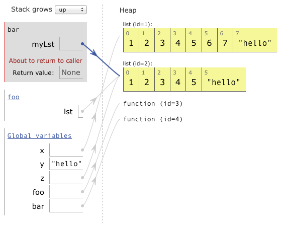

  [PDF syllabus](docs/syllabus.pdf)

### Software

[Python 3](http://python.org/)
</img>

[Pycharm](https://www.jetbrains.com/pycharm/)
</img>

[repl.it](https://repl.it)
</img>

[pythontutor.com](http://pythontutor.com)
</img>

[processing.org](http://processing.org)
</img>

### Learning Goals

Introduction to solving computational problems, including the
fundamentals of computer programming. Topics include imperative
programming constructs (variables, loops, conditionals, functions,
recursion), basic object-oriented constructs (classes, objects), and
some fundamental algorithms and data structures (dictionaries, arrays,
linked lists). Student learn these concepts through studying the
Python programming language.

At the end of the course, you will be able to:

-   Read, understand and execute a computer program written in Python.
-   Read a set of requirements for a computer program in English, and
    write a short Python program (100 lines or less) that corresponds to
    them.
-   Test a Python program and identify and fix programming errors.
-   Identify some errors in a Python program without testing it.
-   Without using a computer, write a very short Python code fragment
    (10 lines or less) that correctly implements a set of requirements.
-   Understand and apply variables, loops, strings, lists, conditionals,
    and functions.
-   Write programs to perform mathematical calculations.
-   Understand the concepts of class and object, and distinguish between
    them.
-   Write a Python program including objects of multiple interacting
    student-designed classes.
-   Write and understand appropriate comments in a Python program.
-   Understand the concept of an algorithm and compare the efficiency of
    different algorithms for a simple task.

### Disabilities

It is the policy of Hendrix College to accommodate students with
disabilities, pursuant to federal and state law. Students should contact
Julie Brown in the Office of Academic Success (505.2954;
`brownj@hendrix.edu`) to begin the accommodation process. Any student
seeking accommodation in relation to a recognized disability should
inform the instructor at the beginning of the course.

### Academic Integrity

All Hendrix students must abide by the College’s [Academic Integrity
Policy](https://www.hendrix.edu/studentlife/handbook.aspx?id=67121) as
well as [the College’s Computer
Policy](https://www.hendrix.edu/studentlife/handbook.aspx?id=42308),
both of which are outlined in the Student Handbook.

For specific ways the Academic Integrity policy applies in this course,
please refer to the [Computer Science Academic Integrity
Policy](http://ozark.hendrix.edu/~yorgey/ac-integrity-policy.html).

The short version is that academic integrity violations such as copying
code from another student or the Internet are **easy to detect** and will
be **taken very seriously**.

If you have any questions about how the Academic Integrity policy
applies in a particular situation, please contact me.

### Laptops

Please **do not bring laptops to lecture**.  This may seem strange in
a computer science class.  But lab is the place where you will get
plenty of experience working on the computer; lecture is a time for
thinking and learning without the distraction of a computer.

Exceptions may be made on a case-by-case basis if you can prove to me
that you really do benefit from using your laptop to take notes.

### Late Days

Each student has **four late days** to spend throughout the semester
as they wish.  Simply inform the instructor any time *prior* to the
due date for an assignment that you wish to use a late day; you may
then turn in the assignment up to 24 hours late.  Multiple late days
may be used on the same assignment.  There are no partial late days;
turning in an assignment 2 hours late or 20 hours late will both use 1
late day.  Note that late days are intended to cover both normal
circumstances (you simply want more time to work on the assignment)
and exceptional circumstances (you get sick, travel for a game or
family obligation, *etc.*).  After you have used up your late days,
late assignments will receive at most half credit.
